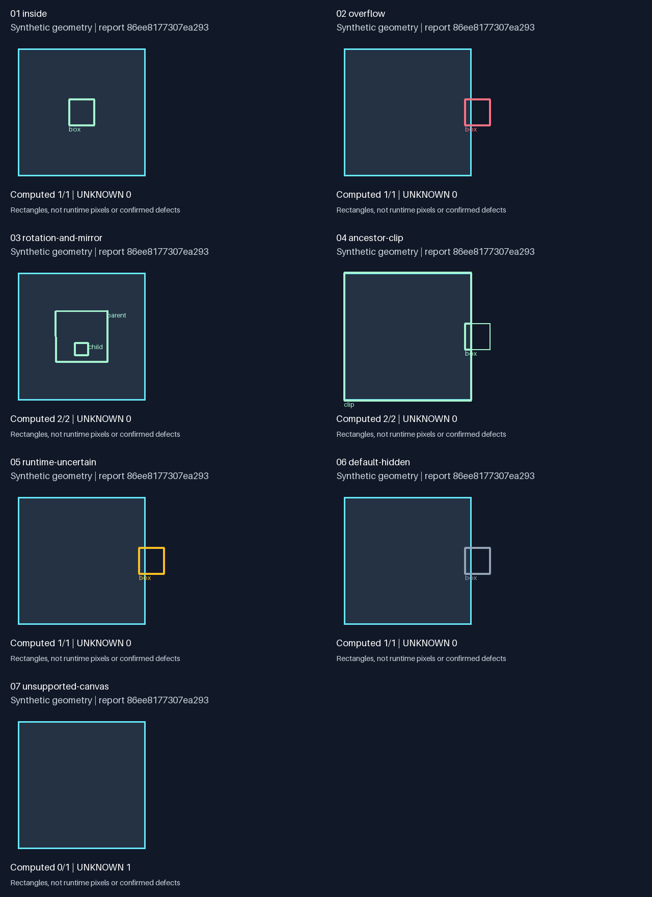

# Unity uGUI Layout Probe

Experimental Python geometry helpers for Unity uGUI layouts, with synthetic JSON/PNG demos, explicit unknowns, and a bounded case study.

**Frozen research snapshot · experimental v0.1.1.** For developers who want to inspect an explicitly supplied RectTransform hierarchy, understand static overflow calculations, or reuse a small geometry reference. No game, IPA/APK, Unity installation, or Unity project is required.

Input: [seven original JSON scenes](examples/layouts.json). Output: `summary.json`, numbered PNGs and an overview, generated from rectangles rather than game artwork.

Clone or download this repository and enter its directory first, then run:

```sh
uv run --with-requirements requirements.txt python demo.py
```

**Limits:** no systematic comparison against native Unity runtime results has been completed. Determinism does not establish correctness. Static overflow is not a confirmed runtime defect; `UNKNOWN` is not a pass. This is an experimental reference for explicit JSON inputs, not a Unity importer or UI test runner.



Thin lines show original rectangles; thick lines show ancestor-clipped rectangles; cyan frames show viewports.

[Release and demo downloads](https://github.com/icekree/unity-ugui-layout-probe/releases) · [Linux CI](https://github.com/icekree/unity-ugui-layout-probe/actions) · [中文说明](README.zh-CN.md) · [Input and report contract](docs/format.md) · [Bounded engineering case](docs/case-study.md) · [Attribution](THIRD_PARTY.md) · [Release fixes](CHANGELOG.md)

## Run and inspect

Use Python 3.12 and [uv](https://docs.astral.sh/uv/). The geometry module uses only the Python standard library; the demo pins `Pillow==12.3.0` and uses its bundled default font.

```sh
uv run --with-requirements requirements.txt python demo.py --input examples/layouts.json --output artifacts/demo
uv run --with-requirements requirements.txt python -m unittest discover -s tests -v
```

Default output is `artifacts/demo/<report_id>/`; the command prints this actual report directory. Each case has a numbered image; `overview.png` combines them and `summary.json` records hashes, environment, parameters, counts and per-node results. Different reports have separate directories, while the same analysis can be repeated in place. Existing symlink or hard-link output files are rejected before writing. You can also install `requirements.txt` in a Python 3.12 environment and run `python demo.py`.

The default fixture has nine nodes: eight computed and one `UNKNOWN`. The overflow example is a 20-pixel-wide box spanning x=95..115 in a 100-pixel-wide viewport: right overflow is 15 pixels and outside area ratio is 0.75. These [hand-derived expectations](examples/expected.json) are checked separately from report generation.

## What the reference covers

`geometry.py` contains CanvasScaler constant-pixel-size and scale-with-screen-size formulas, anchors, pivots, hierarchical TRS transforms, quaternion rotation, mirrored winding, convex ancestor clipping and screen overflow distances/area ratios. The demo supports only an explicitly declared Screen Space Overlay Canvas. Clipping means supplied rectangular ancestor geometry; it does not emulate arbitrary stencil masks, sprite opacity or Unity component behavior.

The input must supply runtime uncertainty and visibility state. No code discovers animations, scripts, layout groups, nested Canvas behavior, DPI or camera projection. A/B/C are static triage labels for computed overflow:

| Label | Meaning |
| --- | --- |
| A | Supplied state is visible, with no declared runtime uncertainty |
| B | Supplied state includes runtime uncertainty |
| C | Supplied state is hidden, disabled, near-transparent or expected |
| UNKNOWN | Geometry cannot be resolved; the report includes a reason |

C takes priority over B. Hidden nodes can still have valid geometry. Fully clipped valid nodes are counted as computed with `fully_clipped: true`; invalid or degenerate geometry is `UNKNOWN`. Nodes without overflow have no A/B/C label. Only successfully calculated geometry contributes to the computed count.

## Verification and reuse

The Linux CI uses Python 3.12, runs analytical and invalid-input tests, and generates the demo. Tests cover rotation, mirroring, clipping, tolerance, visibility/uncertainty, parent failures and repeatability. In the same environment, two runs must produce identical JSON/PNG bytes and leave the input bytes unchanged. Cross-version or cross-platform byte identity is not promised.

Standard matrix, polygon-clipping and Unity layout formulas are not new algorithms. This project's contribution is the small implementation, explicit failure contract, original fixtures, verification and bounded case documentation. See [source and specification attribution](THIRD_PARTY.md). Code and original fixtures are MIT licensed; Pillow retains its own license.

This is a finite portfolio artifact, not a maintained general parsing platform. [Issues](https://github.com/icekree/unity-ugui-layout-probe/issues) are open for small synthetic reproductions, analytical counterexamples, concrete reuse and citations. Do not upload game archives, credentials or private captures. No response or continued-development schedule is promised.
